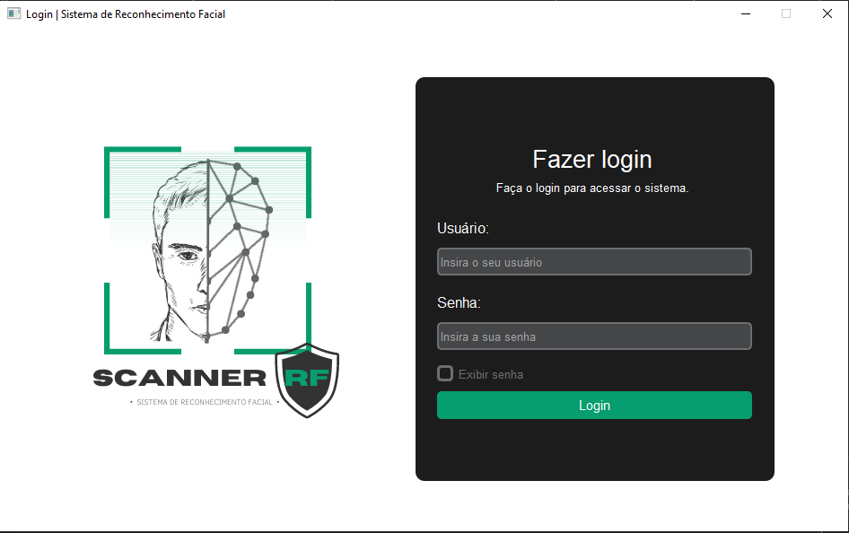
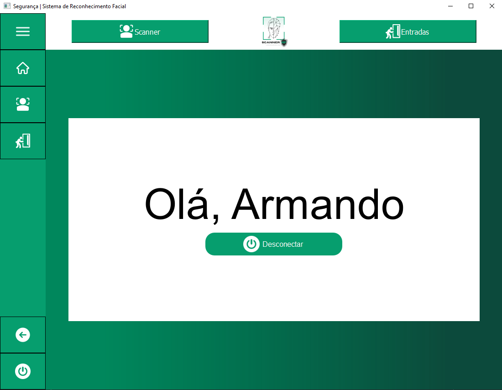

SCANNERRF: Sistema de identificação de pessoas com 
reconhecimento facial

O ScannerRF é um projeto do Trabalho de Conclusão de Curso apresentado na ETEC DA ZONA LESTE, participando de varios eventos como Engetec. Esse projeto baseia-se na proposta de desenvolver uma aplicação desktop que tem o intuito de identificar e monitorar o acesso dos estudantes à escola por meio da tecnologia de reconhecimento facial. O software é produzido na linguagem de programação Python, com o auxílio das bibliotecas PYQT5 para criar interfaces gráficas e OpenCV para manipulação e processo de imagens digitais. Utilizando a aplicação é possível fiscalizar a entrada dos alunos, auxiliar a gestão escolar e dificultar o acesso de pessoas indevidas ao ambiente. 

https://github.com/user-attachments/assets/ddb7721c-1c6a-4ccf-818a-98f0ec85517c

VISÃO DA TELA DE LOGIN

VISÃO DA TELA DA HOME DIRETOR

VISÃO DA TELA DA HOME SEGURANÇA

PASSOS PARA EXECUTAR O SCANNERRF: 
<ul>
  <li>Utilizar um webcam</li>
  <li>NO PROMPT DE COMANDO</li>
  <ul> 
    <li>Clonar o repositorio --> git clone linkDoRepositorio.git</li>
    <li>Ativar o ambiente virtual:</li>
      <ul>
        <li>criando ambiente virtual -> python -m venv venv</li>
        <li>ativando o ambiente virtual -> venv\Scripts\activate </li>
      </ul>
    <li>Instalar as seguintes dependencias:</li>
      <ul>
        <li>pip install opencv-python</li>
        <li> pip install Pillow</li>
        <li>pip install numpy</li>
        <li>pip install PyQt5</li>
        <li>pip install pygame</li>
      </ul>   
  </ul>
</ul>

 
